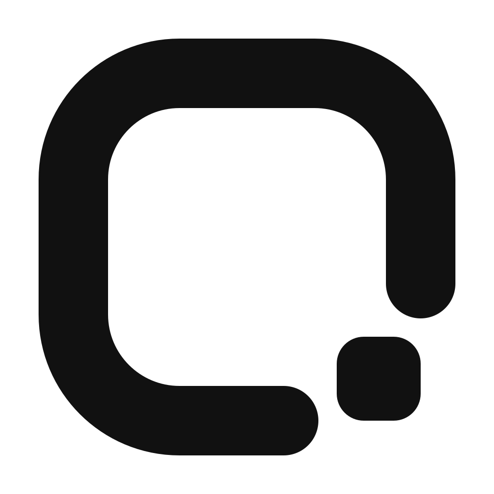

<p align="center">
  <a href="https://www.agentui.pro">
    
  </a>
</p>

<h1 align="center">AgentUI</h1>

<p align="center">
  AI agent components for React and Next.js. Copy the source, own the code.
</p>

<p align="center">
  <a href="./LICENSE"></a>
  <a href="https://ui.shadcn.com/docs/registry"></a>
</p>

<p align="center">
  <a href="https://www.agentui.pro">Website</a>
  ·
  <a href="https://www.agentui.pro/components/agents">Agent components</a>
  ·
  <a href="https://www.agentui.pro/llms.txt">llms.txt</a>
</p>

## What is AgentUI?

AgentUI is a source-first component library for AI agent interfaces. The public catalogue contains 17 component pages and 19 installable registry items covering conversations, streaming responses, reasoning, tools, approvals, code, files, media, citations, and workspace navigation.

Each component includes a live preview, usage example, source code, and a shadcn-compatible install item. Components are copied into your application so you own the implementation and can adapt it without a runtime AgentUI package.

## Install a component

Open any component page and copy the direct install command:

```bash
npx shadcn@latest add https://www.agentui.pro/r/message.json
```

The planned `@agentui` namespace can be configured today in your project's `components.json`:

```json
{
  "registries": {
    "@agentui": "https://www.agentui.pro/r/{name}.json"
  }
}
```

After that, `npx shadcn@latest add @agentui/message` works. Direct URLs remain the zero-configuration path until the namespace is accepted into shadcn's public registry directory. You can also copy the source directly from the component page.

## Public catalogue

- Conversation: Message Bubble, Message, Message Scroller, Prompt Input
- Work state: Agent Activity, Agent Loading States, Todo List
- Results: Streaming Response, Tool Result, Code Block, File Diff
- Human control: Tool Approval, Approval Card
- Evidence and media: Citations, Image Generation
- Workspace: AI Sidebar, Chat App

## For AI agents

AgentUI exposes static endpoints that coding agents can read without scraping the UI.

```txt
https://www.agentui.pro/llms.txt
https://www.agentui.pro/r
https://www.agentui.pro/r/{slug}
https://www.agentui.pro/r/{slug}.json
https://www.agentui.pro/r/{slug}/raw
```

The agent skill is included at [`skills/agentui/SKILL.md`](./skills/agentui/SKILL.md). It helps Cursor, Claude Code, Codex, and other coding agents choose existing `@agentui` components before inventing new motion UI.

## Repository structure

```text
app/                       Next.js site and registry endpoints
components/agents/         Public agent-interface component source
components/previews/agents Live examples and copyable compositions
components/app/            Documentation-site chrome
lib/registry.ts            Component catalogue and install metadata
lib/registry-server.ts     Dependency graph and shadcn item generation
skills/agentui/            Agent-facing component selection workflow
tests/                     Accessibility, interaction, registry, and release checks
```

## Run locally

```bash
bun install
bun run dev
```

Open [http://localhost:3000](http://localhost:3000).

## Checks

```bash
bun run check
```

This runs TypeScript, Biome lint, and registry source validation.

## Contributing

Add agent components in `components/agents/`, previews in `components/previews/agents/`, and registry entries in `lib/registry.ts`.

Read [CONTRIBUTING.md](./CONTRIBUTING.md) before contributing.

## License

AgentUI is available under the [MIT License](./LICENSE).

## Attribution

AgentUI includes modifications of MIT-licensed software. The original copyright and permission notice are preserved in [`LICENSE`](./LICENSE). AgentUI's name, icon, documentation structure, public catalogue, and current product interface are project-specific work; third-party project names and logos are not used.
